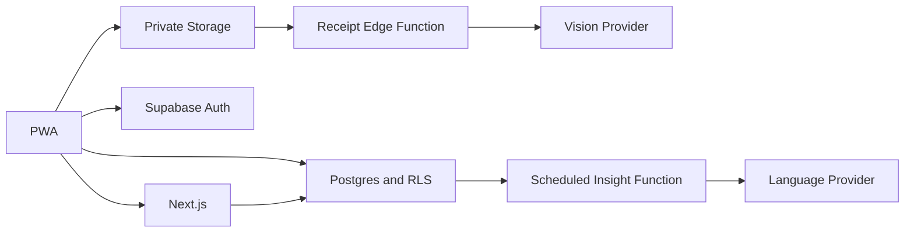

# Vault X architecture

## Boundaries

The browser renders the installable Next.js PWA and uses a Supabase anon-key client for authenticated, RLS-protected operations. Server Components and Route Handlers load financial data through the user's cookie-backed Supabase session. Only Edge Functions and narrowly scoped server routes can access AI credentials or the service role.



## Domain model

`households` and `household_members` define tenancy. Accounts hold balance, institution, purpose, owner label, and APY snapshots. `income_sources` and `income_components` separate gross cash pay, employee taxes, employee pre-tax deductions, employer-paid compensation, variable hours, and usable cash assumptions.

Transactions are the actual ledger and use positive integer minor units with `kind` indicating direction. Income deposits can reconcile to an expected income source. Categories classify transactions. Budgets compare actual category spending against a period limit.

`recurring_bills` is the expected obligation registry. Despite the legacy table name, it includes fixed costs, variable monthly allowances, subscriptions, insurance, and contributions. Each obligation records charge cadence, normalized monthly cost, essential status, billing route, payment privacy, and an optional due date. A missing date is an explicit review state, not an estimated date. Goals and scenario plans represent longer-term intent.

Receipts have a state machine:

```text
uploaded -> processing -> needs_review -> confirmed
                         \-> failed
```

The extractor stores proposed fields and line items. The `confirm_receipt` database function locks the receipt, validates state and membership, creates the transaction, updates the receipt, and writes an audit event in one transaction.

## Financial analysis

Calculations in `src/lib/finance` are deterministic and tested:

- cash-flow totals
- savings rate
- expected spendable income after tax reserves
- recurring monthly equivalent across weekly, monthly, quarterly, semiannual, and annual cadences
- planned margin versus actual ledger margin
- irregular-cost sinking fund requirements
- emergency runway based on essential obligations
- projected interest at current account balances and APYs
- budget utilization
- scenario balance projection

AI is not allowed to calculate source metrics. It receives a compact `FinancialSnapshot`, explains patterns, and links users back to the relevant records. Generated cards retain the source period, provider/model, and snapshot through `insight_runs`.

## Authorization

Every household-owned table enables RLS. Policies call the security-definer `is_household_member` helper, whose search path is empty. Storage policies derive the household UUID from the first path segment. The receipt worker additionally validates the caller through a JWT-backed RLS query before using the service role.

## Operations

- Vercel serves the Next.js application.
- Supabase hosts Auth, Postgres, private receipt Storage, Edge Functions, and weekly Cron.
- GitHub Actions checks lint, types, unit tests, production build, browser smoke flows, migrations, and pgTAP policies.
- `src/instrumentation.ts` is the integration point for OpenTelemetry or a hosted error monitor.

## Deferred architecture

Bank synchronization, investment market data, native clients, granular household roles, and full offline ledger mutation are not included. The normalized ledger and household tenancy leave extension points for those capabilities without changing the core transaction model.
